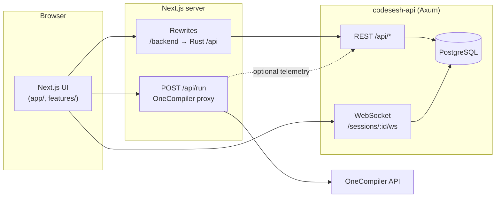

# CodeSesh frontend

**Live app:** [https://codesesh.xyz](https://codesesh.xyz)

A **Next.js** client for real-time collaborative coding: shared Monaco editor, terminal output from code runs, chat, pings, and **private per-user notes**. Guests can join with a display name only; identity is stored locally and sent as `X-User-Id` to the Rust API.

---

## What this app is

CodeSesh is a **browser-based pair programming session**. Someone creates a session (or lands from the marketing page), shares the URL, and collaborators edit the **same document** with live cursors and conflict handling over **WebSockets**. **Run** executes code via the **OneCompiler** API (configured on this Next.js server). The Rust backend persists sessions, chat history, notes, and optional run telemetry.

This repository is **only the web UI** — session logic and persistence live in [`codesesh-api`](../codesesh-api).

---

## Tech stack

| Area | Choice |
|------|--------|
| Framework | **Next.js 16** (App Router), **React 19**, **TypeScript** (strict) |
| Styling | **Tailwind CSS v4**, **shadcn/ui** (Base UI primitives) |
| Editor | **Monaco** (`@monaco-editor/react`) |
| Realtime | **WebSocket** to the Rust API (`lib/ws-url.ts`, `contexts/session-context.tsx`) |
| Data fetching | **TanStack Query** where REST is used |
| Local state | **Zustand** (e.g. user id / guest identity) |
| Notes | **TipTap** |
| Code execution | **Next.js Route Handler** `app/api/run` → **OneCompiler** (not the browser hitting OneCompiler directly) |

---

## Architecture (high level)



- **REST + WebSocket** share the same origin in development via **`next.config.ts` rewrites**: `/backend/*` → `{NEXT_PUBLIC_API_URL}/api/*`. The browser calls `/backend/...`; the Next server forwards to the Rust API.
- **WebSockets** connect **directly** to `NEXT_PUBLIC_API_URL` (see `lib/ws-url.ts`), so that env must be reachable from the user’s browser in production (correct host, `wss://` when the site is HTTPS).

---

## Repository layout (frontend-only)

| Path | Role |
|------|------|
| `app/` | Root **marketing** page, **dashboard** layout with **My sessions** and dynamic **`/sessions/[sessionId]`** |
| `features/landing/` | Marketing homepage |
| `features/dashboard/` | Sidebar, session list, session cards |
| `features/session/` | Session shell: toolbar, editor, terminal UI, chat, notes, mobile tabs |
| `lib/api-client.ts` | `fetch` to `/backend` + `X-User-Id` from the user store |
| `lib/api.ts` | Typed wrappers for REST endpoints |
| `contexts/session-context.tsx` | WebSocket client, sync, chat, collaboration |
| `app/api/run/route.ts` | Server-side code execution (OneCompiler + optional run logging to API) |

---

## Getting started

### Requirements

- **Node.js** (LTS)
- **pnpm** (do not use npm/yarn for this project)

### Install

```bash
pnpm install
```

### Environment

Copy `.env.example` to `.env` and set:

| Variable | Purpose |
|----------|---------|
| `NEXT_PUBLIC_API_URL` | Rust API base URL, e.g. `http://localhost:8080`. Used for rewrites **and** WebSocket URLs. |
| `NEXT_PUBLIC_SITE_URL` | Public site URL (no trailing slash), e.g. `https://codesesh.xyz` — SEO, Open Graph, canonical URLs. |
| `ONECOMPILER_API_KEY` | Required for **Run** — get a key from the [OneCompiler API](https://onecompiler.com/apis/code-execution). |
| `NEXT_PUBLIC_GA_MEASUREMENT_ID` | Optional — Google Analytics 4. |

If `NEXT_PUBLIC_API_URL` is missing, the code defaults to `http://localhost:8080`.

### Develop

```bash
pnpm dev
```

Open [http://localhost:3000](http://localhost:3000). Start the Rust API separately (see the API README) so `/backend` and WebSockets work.

### Production build

```bash
pnpm build
pnpm start
```

---

## How to use the app

1. **Landing page** — Create or join a session (guest name only if you do not sign in as a stored user).
2. **My sessions** — Lists sessions you host or joined; create new sessions from here.
3. **Inside a session** — **Editor** (Monaco), **Run** (executes via OneCompiler), **Terminal** (output), **Chat**, **Ping** other participants, **Notes** (private to you). **Share** copies the session link.
4. **Mobile** — Tab bar switches Editor / Terminal / Chat / Notes; a control opens the dashboard sidebar.

Identity: the app creates or loads a user id in local storage and sends **`X-User-Id`** on API requests — there are **no auth cookies** from this frontend.

---

## Related repo

- **[codesesh-api](../codesesh-api)** — Axum + PostgreSQL + WebSocket session server.
